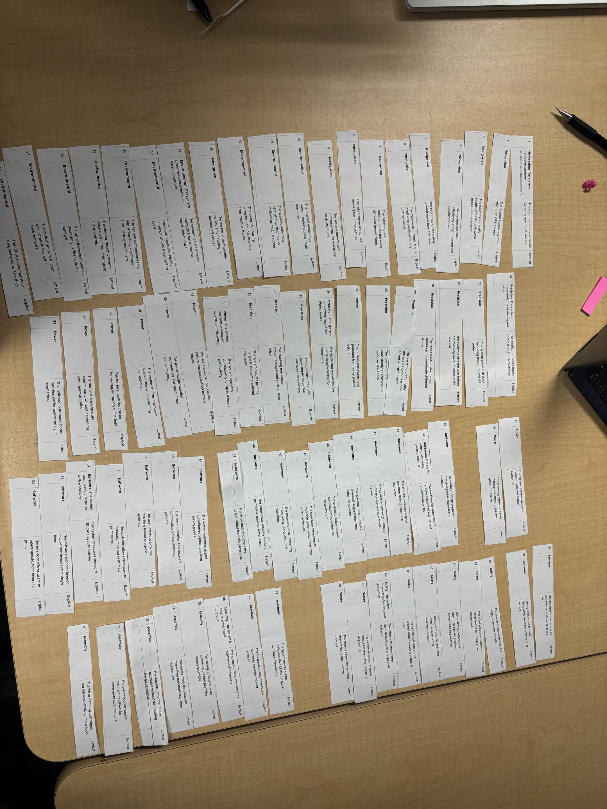

## User Needs and Benchmarking

# Our Charter:

> Our team is committed to designing and developing an open‑source, reliable, and affordable autonomous robot that transforms how construction layout work is performed. We aim to create a system capable of accurately marking floor plans, assisting builders on new home foundations, and improving efficiency and precision in construction layout design.
>We value accessibility, transparency, and engineering excellence. By keeping our platform open-source, we empower builders, students, and innovators to adapt, improve, and expand the robot’s capabilities. Our work emphasizes safety, durability, and real‑world usability, ensuring the robot can operate effectively in demanding construction environments.
>As a team, we commit to collaboration, accountability, and continuous learning. We will communicate openly, support one another’s strengths, and uphold high standards in both technical development and project management. Our shared goal is to deliver a tool that meaningfully improves construction workflows and sets a foundation for future innovation in autonomous field robotics.

# Our listed 75 Topics:
> https://drive.google.com/file/d/1cyUudhoKX9vOMTq7gsFNpnS_yjHevA7D/view?usp=sharing
> Placed into a drive for visual clarity of the website. 

# Our Sorted Ideas:

{style="transform: rotate(90deg); width: 400px;"}

{style="transform: rotate(90deg); width: 400px;"}

{style="transform: rotate(90deg); width: 400px;"}

{style="transform: rotate(90deg); width: 400px;"}

> We chose to create our list on a google doc then print and cut all of our ideas.