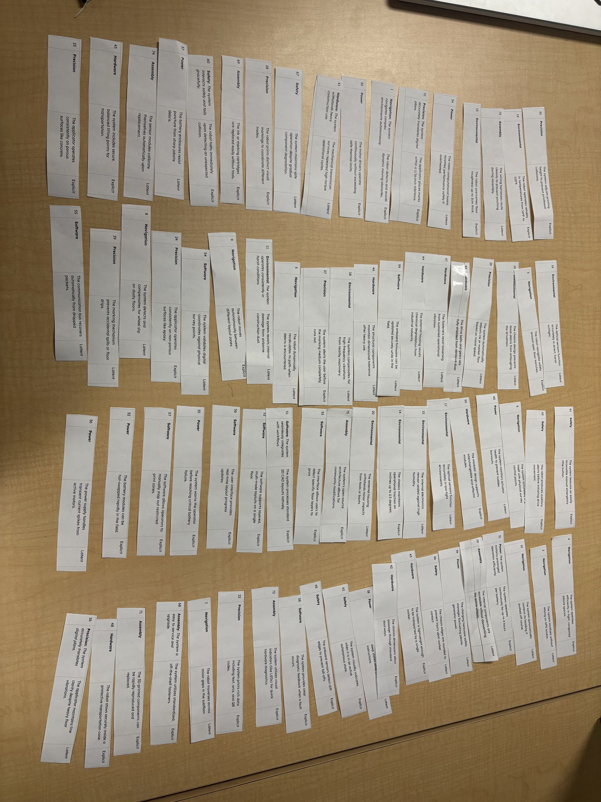
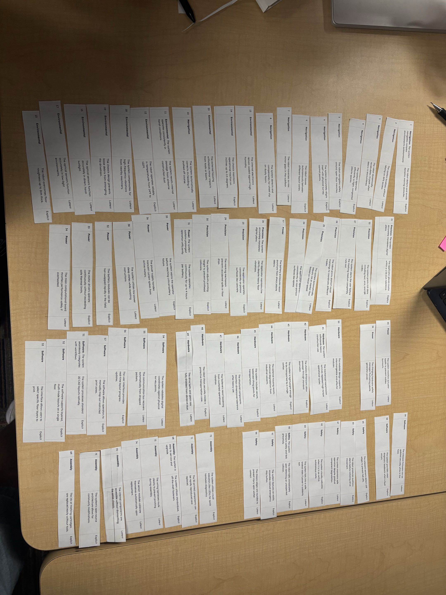
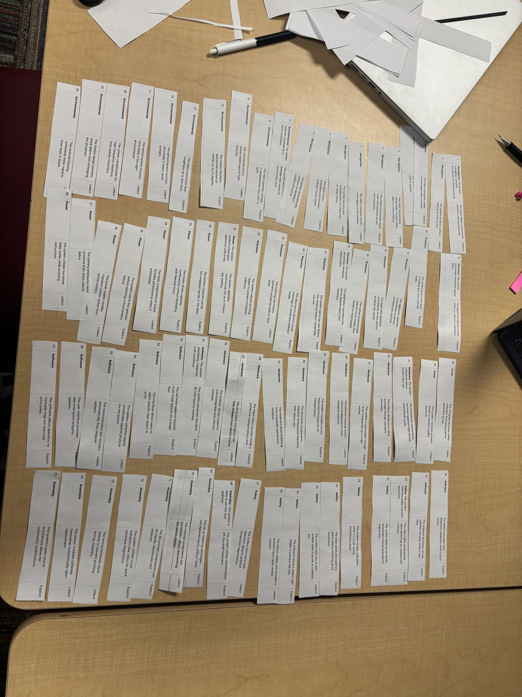

## User Needs and Benchmarking

# Our Charter:

> Our team is committed to designing and developing an open‑source, reliable, and affordable autonomous robot that transforms how construction layout work is performed. We aim to create a system capable of accurately marking floor plans, assisting builders on new home foundations, and improving efficiency and precision in construction layout design.
>We value accessibility, transparency, and engineering excellence. By keeping our platform open-source, we empower builders, students, and innovators to adapt, improve, and expand the robot’s capabilities. Our work emphasizes safety, durability, and real‑world usability, ensuring the robot can operate effectively in demanding construction environments.
>As a team, we commit to collaboration, accountability, and continuous learning. We will communicate openly, support one another’s strengths, and uphold high standards in both technical development and project management. Our shared goal is to deliver a tool that meaningfully improves construction workflows and sets a foundation for future innovation in autonomous field robotics.

# Our listed 75 Topics:
> https://drive.google.com/file/d/1cyUudhoKX9vOMTq7gsFNpnS_yjHevA7D/view?usp=sharing
> Placed into a drive for visual clarity of the website. 

# Our Sorted Ideas:

| Unorganized | Categorized | Sorted |
| :---: | :---: | :---: |
| {style="transform: rotate(270deg); width: 400px;"} | {style="transform: rotate(270deg); width: 400px;"} | {style="transform: rotate(270deg); width: 400px;"} |

> We chose to create our list on a google doc then print and cut all of our ideas.

## Expert Interview:

# Interview Questions for Jake

### 1. In the robotics field, what are some issues you have encountered when troubleshooting your projects?

For example, in current exoskeleton projects, what recurring issues have you noticed during experimental trials?

### 2. Have you ever experienced communication failures between devices while working on a project? If so, what is an example?

*Context: Our project will consist of hardware design and troubleshooting communication between multiple controllers.*

### 3. When designing a robotics system with multiple components or modules, what are some of the biggest integration problems you have encountered?

**Response:** Measurements and components not fitting together properly.

### 4. What factors do you consider when selecting components such as sensors, motors, microcontrollers, or motor drivers for a robotics project?

**Response:** Power supply, dimensions, use case, customer requirements, and budget.

### 5. How important is designing a product for assembly, and what should engineers consider before they begin manufacturing a prototype?

**Response:** One of the biggest considerations is tolerance and making sure everything fits together properly. Machining capabilities also need to be considered because, without specific machinery, you may not be able to manufacture the part you originally designed.

### 6. How do you decide whether a component should be 3D printed, machined, purchased, or manufactured another way?

**Response:** It depends on the use case. If a stronger part is required, it should generally be machined or purchased. If an appropriate component is available off the shelf, it should be purchased. If something needs to be manufactured quickly or does not require as much strength, 3D printing can be a good option.

### 7. How do engineers handle situations where the ideal component is too expensive, unavailable, or difficult to source?

**Response:** You can manufacture your own component if the existing option is too expensive or substitute it with another component. If the component is not necessary, it may also be removed entirely. There is usually an alternative solution.
