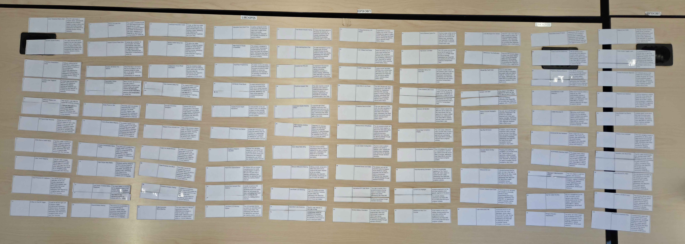
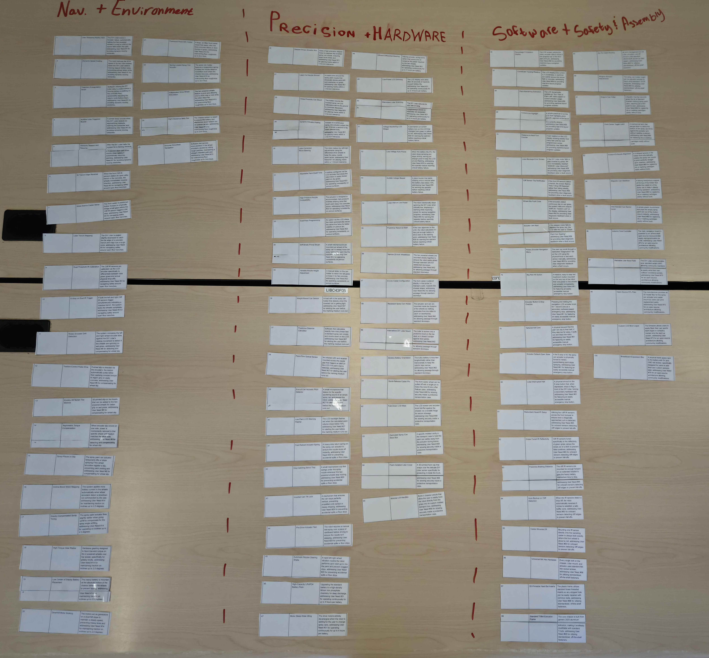
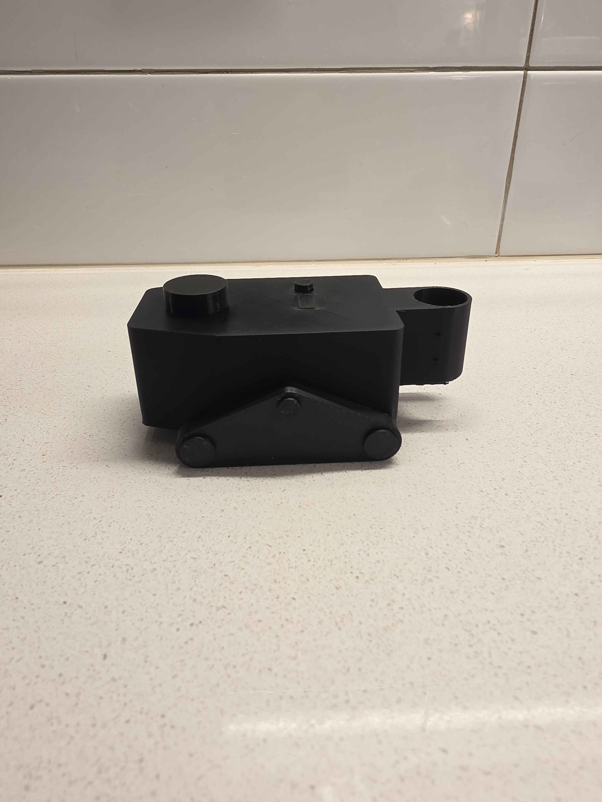

## Section Overview

> The goal of this section was to create, organize, and develop a large set of possible features for our team’s robotics project, then combine the strongest ideas into three distinct product concepts that visually demonstrate how our design could meet the project’s user needs and technical requirements.

## Our Ideas

| Unsorted |
| :---: |
|  |

| Catagorized |
| :---: |
|  |

## Product Concepts

| CAD Model |
| :---: |
| {style="width: 600px; height: auto;"} |

| 3D Print |
| :---: |
|  |

## Our Video
>DISCLOSURE: Our video has been created using the assistance of AI.

Embedded a YouTube video that covers the  -->
